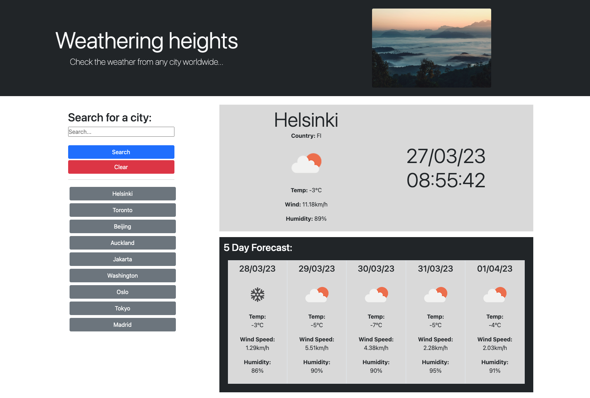

# Weather Forecast Application
An application to determine weather data of a chosen city, including a five day forecast.

## Deployment link

https://elibrer.github.io/weather-app/

## Description

This repository contains the code base for an online weather application, which displays current weather data alongside a five day forecast. The user may then go back and press any of the buttons that relate to their recent searches, and re-display the city weather information. 

This project has increased my knowledge of libraries such as Bootstrap, as well as the implementation of API's to fetch data from other websites, to be used within the scope of the application.

## Table of Contents (Optional)

- [Features](#features)
- [Usage](#usage)
- [Languages Used](#languages-used)
- [Weather App Preview](#weather-app-preview)
- [Credits](#credits)

## Features

- When the page loads, a default value of 'Sydney' is displayed, while showing the current time and date and relative data explained below.
- Searching for a new city name in the input updates the application to display the new city name instead.
- If an invalid city name is entered, the program will stop and an error alert will be shown.
- The entered ciy name will always be saved with a capital first letter and lowercase letters following, regardless of what is entered.
- Depending on what city has been selected, the application will show the current temperature, wind speed, and humidity percentage. Further, an icon image that represents the days weather conditions is displayed.
- Underneath the current weather data shows five cards that display the weather forecast for the next five days of the selected city, with the same information shown. 
- When the search button is pressed, the city name is prepended to local storage within an array (prepended so most recent will always be at the beginning of the array), which is added to every time a new city is searched for.
- Cities within this array will never be duplicated, however if a duplicate city name is entered, the old array entry is removed, and the new one is added to the beginning of the array, updating that entry as most recent.
- A button element is created undernearth the search container for every value within the city array, with the name of the button relative to the index of the array.
- Pressing the new buttons will update the program with the relative city name attached to the button, therefore displaying the data from that selected city once more.
- Pressing the city name button will also reorder the city's name within the array, so it becomes the most recent index number, and therefore the button is prepended to the top of the list.
- Pressing the clear button will delete all entries within local storage, and clear the existing city buttons.

## Usage

This application is designed to give the user a simple and easy way to check the current and forecasted weather of a chosen city. The program is easy to use, and provides useful weather information which is nicely displayed on the page.

## Languages Used
- ### **HTML**
- ### **CSS**
- ### **JavaScript**

## Weather App Preview

## Credits

### *Resources utilised from various websites:*
[Checking duplicate values within an array](https://sentry.io/answers/how-do-i-check-if-an-array-includes-a-value-in-javascript/)
[Switch statements within Javascript](https://www.programiz.com/javascript/switch-statement)

[Bootstrap website, used for all style and formatting purposes within the application](https://getbootstrap.com/docs/4.0/layout/overview/)

[Understanding what the ` character does. Very useful!](https://blog.bitsrc.io/double-quotes-vs-single-quotes-vs-backticks-in-javascript-3cab5aaea55)

[JavaScript library for accessing time and date](https://day.js.org/)

[setTimeout](https://developer.mozilla.org/en-US/docs/Web/API/setTimeout)

[Stopping intervals](https://code.mu/en/javascript/book/prime/timers/timer-stopping/#:~:text=To%20stop%20the%20timer%2C%20use,the%20timer%20to%20be%20stopped.&text=Let%20a%20variable%20be%20given,this%20value%20to%20the%20console.)

[Glossary of Semantics](https://developer.mozilla.org/en-US/docs/Glossary/Semantics)

[Best practices for creating quality meta descriptions](https://developers.google.com/search/docs/appearance/snippet)

[Input tags](https://www.w3schools.com/tags/tag_label.asp)

[Creating links in a README.md file](https://docs.readme.com/main/docs/linking-to-pages)

[Badge generator](https://shields.io/)

